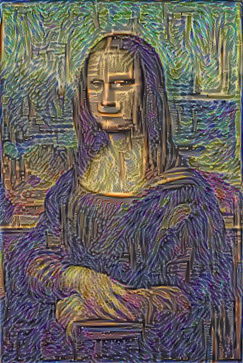

Transferring style with WGG19 
=============================

### Conda env: 
```
conda create -n style python=3.7 tensorflow-gpu==1.15.0
pip install -r requirements.txt
```
### Download:
###### /data/imagenet/
###### Download [Link](https://www.vlfeat.org/matconvnet/models/imagenet-vgg-verydeep-19.mat)

### Run:
```
conda activate style && \
python main.py
```
### Options:
```
python main.py --style starry_night.jpg --content marilyn_monroe.jpg --noise 0.6 --beta 0.6 --alpha 100 --itter 100
```  
### Results:

